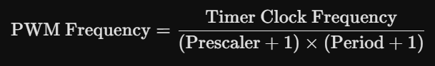
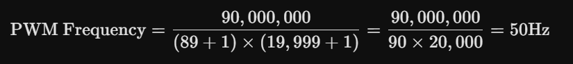

# 객체 추적 시스템

## Member B

- **FreeRTOS 환경 구축:** STM32에 RTOS를 올리고 UART 수신, CAN 송신, 모터 제어 태스크(Task) 분리 및 우선순위 할당.
        
- **통신 인터페이스 구현 (HAL):** 호스트로부터 UART로 목표 좌표/제어 명령 수신, 서보 모터(또는 모터 드라이버)로 CAN 통신 신호 송신.
        
- **하드웨어 제어:** 수신된 좌표 오차를 기반으로 2축 서보 모터 구동 로직 작성, 조준 완료 시 레이저 포인터 격발(GPIO 제어).

### 개발 환경 구축

- STM32CUBE IDE 설치
    - 기반 기술: 전 세계적으로 유명한 'Eclipse' 에디터와 'GCC' 컴파일러를 기반으로 합니다.

    - MX 내장: 예전에는 두 프로그램을 따로 썼지만, 이제는 IDE 안에 MX가 들어와 있어서 탭 하나로 왔다 갔다 하며 설정을 바꿀 수 있습니다.

    - 강력한 디버깅: 실시간으로 MCU 내부 변수 값을 확인하거나, 코드를 한 줄씩 실행하며 논리 오류를 잡는 데 최적화되어 있습니다.

    - 빌드 시스템: 쓴 코드를 기계어(Binary/Hex)로 바꿔서 실제 칩에 구워주는 역할을 합니다.

- STM32CUBE MX 설치
    - 핀 마이크로 매니징: STM32는 핀 하나가 여러 기능을 수행할 수 있습니다. (예: PA9 핀을 일반 입출력으로 쓸지, 통신용 UART로 쓸지 마우스 클릭으로 결정)

    - 클럭(Clock) 설정: 컴퓨터의 CPU 속도를 조절하듯, MCU 내부의 심장 박동수를 시각적인 다이어그램을 보며 설정합니다.

    - 코드 생성(Code Generation): 설정을 마치고 버튼을 누르면, 복잡한 레지스터 설정을 자동으로 해주는 C언어 초기화 코드를 생성해 줍니다.

    - 미들웨어 통합: FreeRTOS, TCP/IP, USB 스택 같은 복잡한 소프트웨어를 클릭 몇 번으로 프로젝트에 포함시킬 수 있습니다.

- FreeRTOS(Real-Time Operating System)
    - Task(태스크): 프로그램을 기능 단위로 쪼갠 것 (예: 통신 태스크, 모터 제어 태스크).

    - 스케줄링: 우선순위가 높은 일을 먼저 처리합니다. 타겟 추적 프로젝트에서는 '모터 제어'가 'UI 업데이트'보다 우선순위가 높아야 끊김 없는 추적이 가능합니다.

    - Queue/Semaphore: 태스크끼리 데이터를 안전하게 주고받거나 자원을 선점하기 위한 도구입니다.

- HAL(Hardware Abstraction Layer)
    - 복잡한 MCU의 레지스터를 몰라서 함수 호출 한 번으로 제어할 수 있게 도와주는 라이브러리


#### STM32CubeMX 초기 설정

* **SYS (System):**
    * `Debug`: **Serial Wire** (디버깅 및 펌웨어 다운로드 활성화)
    * `Timebase Source`: **TIM1** 변경 (중요: FreeRTOS의 SysTick 점유로 인한 충돌 방지)
* **RCC (Clock):**
    * `High Speed Clock (HSE)`: **Crystal/Ceramic Resonator** (외부 클럭 소스 사용)

* ⚠️ 트러블슈팅: Task 함수 위치 확인
- **현상**: `freertos.c`가 아닌 `main.c` 파일 하단에 Task Entry 함수가 생성됨.
- **원인**: CubeMX 설정 중 'Keep User Code when re-generating' 옵션이나 'Generate peripheral initialization as a pair of .c/.h files' 옵션 설정 차이로 인한 현상.
- **조치**: `main.c` 하단의 `StartDefaultTask` 내부에 LED 제어 로직을 작성하여 시스템 정상 동작 확인.
- **학습**: 프로젝트 규모가 커지면 파일 분할 옵션을 활성화하여 `main.c`의 비대화를 방지하는 것이 효율적임.

##### Connectivity (통신) 설정
* **USART2 (Member A 협업용):**
    * `Mode`: **Asynchronous** (비동기 방식)
    * `Baud Rate`: **115200 bps**
    * **NVIC Settings**: `USART2 global interrupt` **Enabled** 체크 (데이터 수신 실시간성 확보를 위한 인터럽트 필수 활성화)

#####  Middleware 설정
* **FreeRTOS:**
    * `Interface`: **CMSIS_V2**
    * `Task 설정`: 기본 `defaultTask` 생성 확인 (향후 시스템 확장에 따라 `UartTask`, `MotorTask` 추가 예정)

#####  Clock Configuration
* **HCLK (MHz)**: **180**
    * F446RE의 최대 동작 클럭으로 설정하여 연산 및 처리 속도 최적화

- 라즈베리파이5 STM32 F446RE MG90S 2개

### STM32CubeMX 추가 설정
- 시스템 클럭 : 90MHz
- 타임베이스 : TIM4
    - OS가 없는 일반 펌웨어는 시스템의 시간축을 위해 SysTick이라는 내장 타이머를 독점
    - FreeRTOS를 켜는 순간 SysTick은 사용 불가능하므로, 다른 타이머(TIM4)를 이용하여 시간 독립을 시켜 충돌 차단, FreeRTOS는 HAL드라이버를 사용
- Prescaler=89, Period=19999 => PWM 주기 설정
    - 모터 드라이버나 서보모터를 부드럽게 제어하기 위해 제어 신호의 주기가 하드웨어 표준 사양과 정확히 일치하게 만들기 위함.
    - 
    - 
- `PWM` : 디지털 신호의 on/off비율을 아주 빠르게 조절하여, 마치 아날로그 전압이 변하는 것처럼 만드는 기술
- GPIO_PULLUP을 키는 이유
    - 플로팅 상태를 막기 위해, 스위치를 누르면 GND(0V)와 연결되어 LOW가 명확히 인지되지만 스위치를 떼면 핀이 어디에도 연결되지 않고 공중에 붕 뜨게 됨.
    - 스위치가 떨어져 있을 때 전압을 VCC 쪽으로 끌어올려(Pull-up) 준다고 하여 붙은 이름, 반대로 저항을 GND 쪽에 붙여 평소에 Low로 묶어두는 방식을 풀다운(Pull-down) 저항이라고 한다.
- **FreeRTOS**
    - Real-Time OS
    - 우선순위가 높은 녀석이 CPU를 독점한다. 즉 A는 무슨 일이 있어도 적황히 실행된다 => 결정론적 시간 보장
    - FreeRTOS에서 작업의 최소 단위를 태스크(Task)라고 부릅니다. C언어에서는 그냥 무한 루프(while(1))를 가진 하나의 함수 형태를 띱니다.

    태스크의 4가지 상태 (State)
    태스크는 생성되면 평생 아래 4가지 상태를 오가며 살아갑니다.

    Running (실행 상태): 현재 CPU 제어권을 쥐고 실제로 코드가 실행 중인 단 하나의 태스크입니다. (싱글 코어 기준)

    Ready (준비 상태): 실행될 준비는 다 끝났으나, 자신보다 우선순위가 높거나 같은 다른 태스크가 CPU를 쓰고 있어서 줄을 서서 기다리는 상태입니다.

    Blocked (차단/대기 상태): 특정 이벤트(시간 지연 완료, 큐에 데이터 도착, 세마포어 획득 등)가 일어날 때까지 스스로 잠든 상태입니다. CPU 자원을 전혀 소모하지 않는 가장 이상적인 대기 상태입니다.

    Suspended (일시 정지 상태): vTaskSuspend() 함수를 통해 강제로 잠재운 상태입니다. 깨우기 전엔 절대 인어나지 않습니다.

## STM32핵심 코드 설명
- [코드](./motor_project/Core/Src/freertos.c)

```c
void HAL_UART_RxCpltCallback(UART_HandleTypeDef *huart) {
    // ... 줄바꿈 검사 후 버퍼 복사 ...
    memcpy(uart_parse_buf, rx_buffer, rx_index + 1);
    uart_msg_ready = 1; // 👈 플래그만 세우고 빠르게 탈출!
    rx_index = 0;
}
```
- ISR(인터럽트 서비스 루틴)
    - Thin ISR, uart선을 통해 데이터를 받는데 최대한 짧고 빠르게 받기 위해서 sscanf,printf금지.
    - osDelay()사용 금지, 같은 이유
    - 값의 무결성을 위해 volatile 키워드 사용
        - 멋대로 최적화하는 것을 방지

```c
float delta_x = Kp_x * ex + Kd_x * (ex - prev_error_x);
if(ex > -(float)deadzone && ex < (float)deadzone) ex = 0.0f; // 데드존
```
- 모터가 데드존에 가만히 있지못하고 계속 흔들리는 버징현상을 막기 위해 PD제어 알고리즘을 구현.

- **PID제어**
    - P(Proportional) :  현재 오차에 비례해서 밝기, ex)오차제곱
        - 멀리 떨어져있으면 엑셀을 꽉 밝고,목표치에 가까워지면 엑셀에서 발을 살짝 떼는 제어, 잔차를 완전히 0으로 만들긴 힘듬
        - 부작용 - 잔차, 100km/h까지 도달 못하고 95km/h까지감
    - I(Integral) : 오차를 누적
        - 95km/h에 정체되어 있으면 오차 5km/h가 시간에 따라 쌓임으로써 100km/h까지 올림, 잔차를 완전히 0으로 만들 수 있음
        - 부작용 - 오버슈트, 오차를 너무 열심히 모아서 100km/h을 넘어버림
    - D(Derivative) : 미분
        - 목표치를 향해 속도가 너무 가파르게 올라가면,변화 속도에 제동을 거는 브레이크 역할을 함. 오버슈트를 감소시킴, 잔차에 변화가 없음
    - 현재 이 프로젝트는 PD제어로만으로 충분해서 I제어는 하지않음 